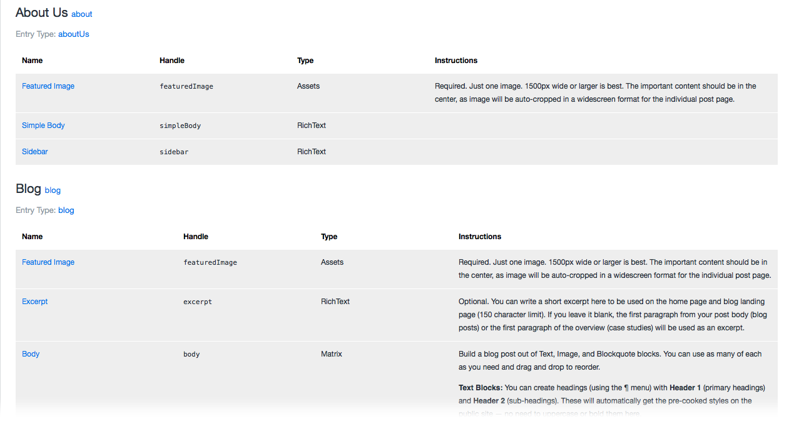

# Field Guide

Using Craft CMS? Field Guide adds a tab to your Dashboard that lists all your fields in a single page, _grouped by section_. Keep it open while you write your templates!

To install, drag the `fieldguide` directory to `craft/plugins`. Activate the plugin under Settings →  Plugins. A new tab titled Field Guide should appear in the control panel.

Many thanks to [Daniel Ott](http://github.com/danieltott) for his significant improvements.